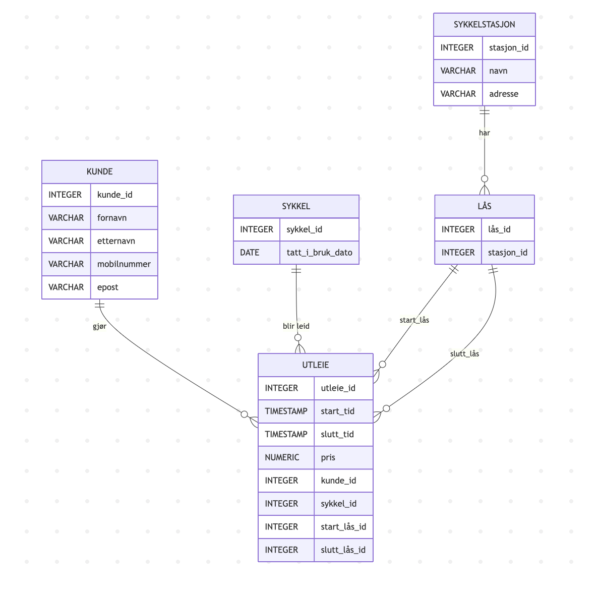
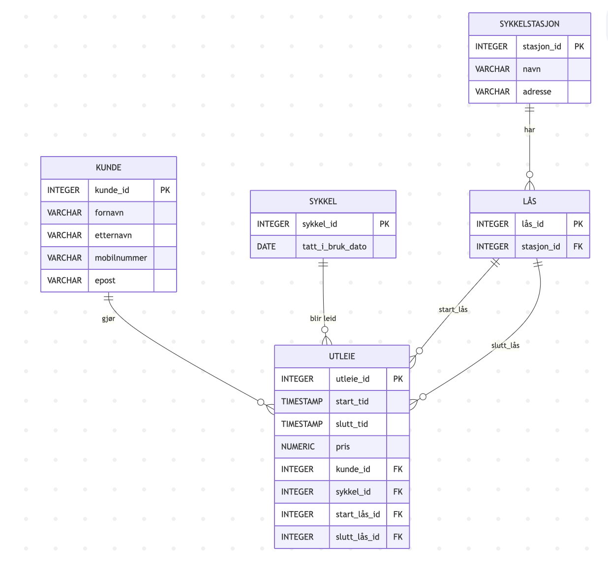

# Besvarelse - Refleksjon og Analyse

**Student:** Herman Bayer Ellingsrud

**Studentnummer:** 408418

**Dato:** [Innleveringsdato]

---

## Del 1: Datamodellering

### Oppgave 1.1: Entiteter og attributter

**Identifiserte entiteter:**

Det første jeg gjør for å finne potensielle entiteter er å lete etter substantiver i casen. Dette er substantivene jeg har funnet:

* Sykkelstasjoner
* Kunder
* Sykler
* Låser
* Utleie
* Betalingskort

For å ikke lage irrelevante identiterer basert på oppgaveteksten, filtrerer jeg bort betalingskort. Dette gir meg da fem entiteter:

* Sykkelstasjoner
* Kunder
* Sykler
* Låser
* Utleie

**Attributter for hver entitet:**

Attributtene beskriver egenskapene til en entitet og brukes til å lagre relevant informasjon om objektene i databasen.

Sykkelstasjonene representerer fysiske stasjoner der sykler kan hentes og leveres. Det er derfor viktig å ha unik identifikator for hver stasjon. Systemet må kunne identifisere hver stasjon og vise kunder hvor den ligger.

Attributter for Sykkelstasjoner:
* stasjon_id
* navn
* adresse

Kunder represtenterer personer som bruker sykkelsystemet.Systemet må derfor kunne identifisere kunder og kunne kontakte dem.

Attributter for Kunder:
* kunde_id
* fornavn
* etternavn
* mobilnummer
* epost

Sykkeler representerer hver fysisk sykkel i systemet. tatt_i_bruk_dato er for å kunne spore når sykkelen ble satt i drift.

Attributter for Sykkler:
* sykkel_id
* tatt_i_bruk_dato

Låsene representerer låsemekanismene ved hver stasjon der sykkelene festes.

Attributter for Låser:
* lås_id
* stasjon_id

Utleie representerer selve leieforholdet mellom kunde og sykkel over tid. Det er flere attributter her for å kunne spore hele reisen til sykkelen.

Attributter for Utleie:
* utleie_id
* start_tid
* slutt_tid
* pris
* kunde_id
* sykkel_id
* start_lås_id
* slutt_lås_id

---

### Oppgave 1.2: Datatyper og `CHECK`-constraints

**Valgte datatyper og begrunnelser:**

I denne databasen bruker jeg unike ID-er for å identifisere hver entitet (sykkel, kunde, stasjon, lås og utleie). Disse ID-ene er av datatypen INTEGER, som er effektiv for lagring og koblinger mellom tabeller. Tekstfelt som navn, adresse og e-post lagres som VARCHAR med passende maks-lengde, mens dato- og tidsinformasjon lagres med DATE og TIMESTAMP. Beløp for utleie lagres som NUMERIC(6,2) for å sikre presisjon med desimaler.

Sykkelstasjon entiteten består av stasjon_id for å identifisere stasjonen, dette er da en INTEGER. Resten av attributtene er da tekst for informasjon om stasjonen.

| Attributt  | Hva slags data | PostgreSQL type |
|------------|---------------|-----------------|
| stasjon_id | unik id       | INTEGER         |
| navn       | kort tekst    | VARCHAR(50)     |
| adresse    | tekst | VARCHAR(100)    |

Kunde entiteten består av kunde_id for å identifisere kunden, dette blir da INTEGER. Og resten av attributtene bester av tekst for å kunne identifisere og kontakte kunden. Mobilnummer er også tekst for mobilnummeret kan starte med 0 og inneholde +47.

| Attributt   | Hva slags data | PostgreSQL type |
|-------------|----------------|-----------------|
| kunde_id    | unik id        | INTEGER         |
| fornavn     | kort tekst     | VARCHAR(50)     |
| etternavn   | kort tekst | VARCHAR(50)     |
| mobilnummer | kort tkest | VARCHAR(15)     |
| epost       | tekst | VARCHAR(255)    |

Sykkel entiteten består også av en sykkel_id for å identifisere sykkelen (INTEGER). tatt_i_bruk_dato er datoen da sykkelen ble satt i bruk og har derfor datatypen Date.

| Attributt   | Hva slags data | PostgreSQL type |
|-------------|----------------|-----------------|
| sykkel_id    | unik id        | INTEGER         |
| tatt_i_bruk_dato     | dato           | Date            |

Lås entiteten består av to attributter, en lås_id for å identifisere låsen (INTEGER) og stasjon_id for å identifisere hvilken stasjon låsen er på (INTEGER)

| Attributt   | Hva slags data               | PostgreSQL type |
|-------------|------------------------------|-----------------|
| lås_id    | unik id                      | INTEGER         |
| stasjon_id     | ID til stasjonen låsen er på | INTEGER            |

Utleie entiteten har en unik id ved utleie_id som INTEGER. start_tid og slutt_tid bruker TIMESTAMP som datatype, pris er et beløp så NUMERIC(6,2) gir 4 tall før komma og 2 tall etter komma, antar at prisene ikke blir dyrere enn dette.
Det er også INTEGER til kunde_id, sykkel_id, start_lås_id og slutt_lås_id. 

| Attributt   | Hva slags data                          | PostgreSQL type |
|-------------|-----------------------------------------|--|
| utleie_id   | unik id                                 | INTEGER |
| start_tid   | tidspunkt for start                     | TIMESTAMP |
| slutt_tid   | tidspunkt for slutt                     | TIMESTAMP |
| pris | beløp                                   | NUMERIC(6,2) |
| kunde_id       | ID til kunden som leier                 | INTEGER |
| sykkel_id   | ID til sykkel som leies                 | INTEGER |
| start_lås_id | ID til lås sykkelen låses opp fra       | INTEGER |
| slutt_lås_id       | ID til lås sykkelen leveres tilbake til | INTEGER |

**`CHECK`-constraints:**

`CHECK`-constraints er nyttige til å sikre dataintegriteten og forhindre at kunder eller brukere legger inn ugyldige verdier. I denne casen kan dette være å passe på at det blir lagt inn gyldige datoer, positive verdier for ID og pris eller gyldige mobilnummer og email.

Sykkelstasjon `CHECK`-constraints:

Her kan en passe på at stasjon_id alltid er positiv ved
* `CHECK` (stasjon_id > 0)

Kunde `CHECK`-constraints:

For å passe på at mobilnummer inneholder tall og eventuelt + foran kan en legge til en `CHECK`-constraint som beskytter mot ugyldige nummer
* `CHECK` (mobilnummer ~ '^\+?[0-9]{8,15}$')

For å passe på gyldig epost kan en sikre at eposten inneholder @ ved
* `CHECK` (epost LIKE '%@%')

Sykkel `CHECK`-constraints:

For å sikre at tatt_i_bruk_dato er gyldig og ikke har en fremtidig dato kan en bruke
* `CHECK` (tatt_i_bruk_dato <= CURRENT_DATE)

Utleie `CHECK`-constraints:

For utleie kan en sjekke at prisen ikke er negativ ved
* `CHECK` (pris >= 0)

En kan også sjekke at start og slutt tidene har et passende forhold med

* `CHECK` (slutt_tid IS NULL OR slutt_tid >= start_tid)

Lås `CHECK`-constraints:

En kan passe på at lås_id ikke er negativ ved
* `CHECK` (lås_id > 0)

**ER-diagram:**

Her er kode for mermaid-koden til ER-diagremmet:

```
erDiagram
    SYKKELSTASJON {
        INTEGER stasjon_id
        VARCHAR navn
        VARCHAR adresse
    }

    KUNDE {
        INTEGER kunde_id
        VARCHAR fornavn
        VARCHAR etternavn
        VARCHAR mobilnummer
        VARCHAR epost
    }

    SYKKEL {
        INTEGER sykkel_id
        DATE tatt_i_bruk_dato
    }

    LÅS {
        INTEGER lås_id
        INTEGER stasjon_id
    }

    UTLEIE {
        INTEGER utleie_id
        TIMESTAMP start_tid
        TIMESTAMP slutt_tid
        NUMERIC pris
        INTEGER kunde_id
        INTEGER sykkel_id
        INTEGER start_lås_id
        INTEGER slutt_lås_id
    }

    %% Relasjoner
    SYKKELSTASJON ||--o{ LÅS : har
    KUNDE ||--o{ UTLEIE : "gjør"
    SYKKEL ||--o{ UTLEIE : "blir leid"
    LÅS ||--o{ UTLEIE : start_lås
    LÅS ||--o{ UTLEIE : slutt_lås
```



---

### Oppgave 1.3: Primærnøkler

**Valgte primærnøkler og begrunnelser:**

I dette tilfellet er alle primærnøklene surrogatnøkler, siden de har lite verdi i det fysiske samfunnet men god verdi i databasen. Disse surrogatnøklene gir leksibilitet hvis naturlige nøkkelverdier endres, som for eksempel epost eller mobilnummer. 

| Entitet        | Primærnøkkel | Begrunnelse |
|----------------|-------------|-------------|
| Sykkelstasjon  | stasjon_id  | Unik ID for hver stasjon. Navn eller adresse kan endres, så surrogatnøkkel er mer stabil. |
| Kunde          | kunde_id    | Unik ID for hver kunde. E-post eller mobilnummer kunne vært unik, men kan endres, derfor surrogatnøkkel. |
| Sykkel         | sykkel_id   | Unik ID for hver sykkel. Tatt_i_bruk_dato er ikke unik, derfor trenger vi en surrogatnøkkel. |
| Lås            | lås_id      | Unik ID for hver lås. Kombinasjon med stasjon_id kunne fungert, men surrogatnøkkel er enklere å bruke. |
| Utleie         | utleie_id   | Unik ID for hver utleie. Start_tid og kunde_id kan gjentas, så vi trenger en separat primærnøkkel. |


**Naturlige vs. surrogatnøkler:**

I denne casen har jeg valgt å bruke surrogatnøkler for alle primærnøkler ettersom surrogarnøklene gir mer stabilitet og fleksibilitet, og gjør det enklere å koble tabeller sammen uten å bekymre seg for at naturlige attributter endres. 

**Oppdatert ER-diagram:**

```
erDiagram
    SYKKELSTASJON {
        INTEGER stasjon_id PK
        VARCHAR navn
        VARCHAR adresse
    }

    KUNDE {
        INTEGER kunde_id PK
        VARCHAR fornavn
        VARCHAR etternavn
        VARCHAR mobilnummer
        VARCHAR epost
    }

    SYKKEL {
        INTEGER sykkel_id PK
        DATE tatt_i_bruk_dato
    }

    LÅS {
        INTEGER lås_id PK
        INTEGER stasjon_id
    }

    UTLEIE {
        INTEGER utleie_id PK
        TIMESTAMP start_tid
        TIMESTAMP slutt_tid
        NUMERIC pris
        INTEGER kunde_id
        INTEGER sykkel_id
        INTEGER start_lås_id
        INTEGER slutt_lås_id
    }

    %% Relasjoner
    SYKKELSTASJON ||--o{ LÅS : har
    KUNDE ||--o{ UTLEIE : "gjør"
    SYKKEL ||--o{ UTLEIE : "blir leid"
    LÅS ||--o{ UTLEIE : start_lås
    LÅS ||--o{ UTLEIE : slutt_lås
```


---

### Oppgave 1.4: Forhold og fremmednøkler

**Identifiserte forhold og kardinalitet:**

| Entitet 1     | Entitet 2 | Forhold                                         | Kardinalitet      | Forklaring                                                                                   |
| ------------- | --------- | ----------------------------------------------- | ----------------- | -------------------------------------------------------------------------------------------- |
| Sykkelstasjon | Lås       | En stasjon har mange låser                      | 1 til mange (1:M) | Hver stasjon kan ha mange låser, men hver lås tilhører kun én stasjon.                       |
| Kunde         | Utleie    | En kunde kan ha mange utleier                   | 1 til mange (1:M) | En kunde kan leie sykler flere ganger, men hver utleie tilhører én kunde.                    |
| Sykkel        | Utleie    | En sykkel kan være med i mange utleier over tid | 1 til mange (1:M) | Hver utleie gjelder én sykkel, men en sykkel kan ha mange utleier historisk.                 |
| Lås           | Utleie    | Hver utleie starter og slutter ved en lås       | 1 til mange (1:M) | En lås kan brukes i mange utleier over tid, men hver start- eller sluttlås peker til én lås. |


**Fremmednøkler:**

| Tabell | Fremmednøkkel | Refererer til             | Forklaring                                                                          |
| ------ | ------------- | ------------------------- | ----------------------------------------------------------------------------------- |
| LÅS    | stasjon_id    | SYKKELSTASJON(stasjon_id) | Hver lås tilhører en stasjon, implementerer 1:M-forholdet mellom stasjon og lås.    |
| UTLEIE | kunde_id      | KUNDE(kunde_id)           | Hver utleie tilhører én kunde, implementerer 1:M-forholdet mellom kunde og utleie.  |
| UTLEIE | sykkel_id     | SYKKEL(sykkel_id)         | Hver utleie gjelder én sykkel, men en sykkel kan ha mange utleier historisk.        |
| UTLEIE | start_lås_id  | LÅS(lås_id)               | Hver utleie starter ved en lås, implementerer 1:M-forholdet mellom lås og utleie.   |
| UTLEIE | slutt_lås_id  | LÅS(lås_id)               | Hver utleie avsluttes ved en lås, implementerer 1:M-forholdet mellom lås og utleie. |


**Oppdatert ER-diagram:**

```
erDiagram
    SYKKELSTASJON {
        INTEGER stasjon_id PK
        VARCHAR navn
        VARCHAR adresse
    }

    KUNDE {
        INTEGER kunde_id PK
        VARCHAR fornavn
        VARCHAR etternavn
        VARCHAR mobilnummer
        VARCHAR epost
    }

    SYKKEL {
        INTEGER sykkel_id PK
        DATE tatt_i_bruk_dato
    }

    LÅS {
        INTEGER lås_id PK
        INTEGER stasjon_id FK
    }

    UTLEIE {
        INTEGER utleie_id PK
        TIMESTAMP start_tid
        TIMESTAMP slutt_tid
        NUMERIC pris
        INTEGER kunde_id FK
        INTEGER sykkel_id FK
        INTEGER start_lås_id FK
        INTEGER slutt_lås_id FK
    }

    %% Relasjoner
    SYKKELSTASJON ||--o{ LÅS : har
    KUNDE ||--o{ UTLEIE : "gjør"
    SYKKEL ||--o{ UTLEIE : "blir leid"
    LÅS ||--o{ UTLEIE : start_lås
    LÅS ||--o{ UTLEIE : slutt_lås
```


---

### Oppgave 1.5: Normalisering

**Vurdering av 1. normalform (1NF):**

Datamodellen som blir fremstilt tilfredstiller 1NF fordi alle attributtene har atomvære verdier, det vil si hvert felt i tabellene inneholder én enkelt verdi, ikke lister eller sett. Det er heller ingen repeterende grupper. Det er altså ingen kolonner som lagrer flere verdier i samme felt.

**Vurdering av 2. normalform (2NF):**

Datamodellen tilfredstiller også 2NF fordi den har atomære verdier og entydige rader. Samtidig er også alle ikke-nøkkel-attributter fullstendig funksjonelt avhengige av hele primærnøkkelen. For eksempel i KUNDE er fornavn, etternavn, mobilnummer og epost alle avhengige av kunde_id.

**Vurdering av 3. normalform (3NF):**

Til slutt tilfredstiller datamodellen også 3NF ettersom 2NF også er tilfredstilt og ingen av ikke-nøkkel-attributter er transitivt avhengige av primærnøkkelen. Det vil si det finnes ingen attributter som kan utledes fra andre ikke-nøkkel-attributter.

**Eventuelle justeringer:**


---

## Del 2: Database-implementering

### Oppgave 2.1: SQL-skript for database-initialisering

**Plassering av SQL-skript:**

SQL-skriptet er lagret i `init-scripts/01-init-database.sql`.

**Antall testdata:**

- Kunder: 5
- Sykler: 100
- Sykkelstasjoner: 5
- Låser: 100
- Utleier: 50

---

### Oppgave 2.2: Kjøre initialiseringsskriptet

**Dokumentasjon av vellykket kjøring:**

Initialiseringsskriptet `01-init-database.sql` ble kjørt mot PostgreSQL-databasen uten feil. Tabellene ble opprettet og testdata ble lagt inn i henhold til spesifikasjonene.

Utklippene under viser noen eksempler på innholdet i databasen:

```
oblig01=# \dt
List of relations
Schema |     Name      | Type  | Owner
--------+---------------+-------+-------
public | kunde         | table | admin
public | lÅs           | table | admin
public | sykkel        | table | admin
public | sykkelstasjon | table | admin
public | utleie        | table | admin
(5 rows)
```

```
oblig01=# SELECT * FROM kunde;
 kunde_id | fornavn | etternavn | mobilnummer |      epost       
----------+---------+-----------+-------------+------------------
        1 | Ola     | Nordmann  | +4712345678 | ola@nordmann.no
        2 | Kari    | Nordmann  | +4798765432 | kari@nordmann.no
        3 | Per     | Hansen    | +4711122233 | per@hansen.no
        4 | Anne    | Larsen    | +4799988877 | anne@larsen.no
        5 | Nina    | Olsen     | +4712341234 | nina@olsen.no
(5 rows)
```
```
oblig01=# SELECT * FROM sykkelstasjon;
 stasjon_id |   navn    |    adresse     
------------+-----------+----------------
          1 | Sentrum   | Storgata 1
          2 | Skolen    | Skoleveien 10
          3 | Stasjonen | Jernbanegata 5
          4 | Stranden  | Strandgata 2
          5 | Parken    | Parkveien 7
(5 rows)
```
```
oblig01=# SELECT * FROM lÅs;
lås_id | stasjon_id
--------+------------
1 |          1
2 |          1
3 |          1
4 |          1
5 |          1
6 |          1
7 |          1
8 |          1
9 |          1
10 |          1
11 |          1
12 |          1
13 |          1
14 |          1
15 |          1
16 |          1
17 |          1
18 |          1
19 |          1
20 |          1
21 |          2
22 |          2
23 |          2
24 |          2
25 |          2
26 |          2
27 |          2
28 |          2
29 |          2
30 |          2
31 |          2
32 |          2
33 |          2
34 |          2
35 |          2
36 |          2
37 |          2
38 |          2
39 |          2
40 |          2
41 |          3
42 |          3
43 |          3
44 |          3
45 |          3
46 |          3
47 |          3
48 |          3
49 |          3
50 |          3
51 |          3
52 |          3
53 |          3
--More--
```
```
oblig01=# SELECT * FROM sykkel;
sykkel_id | tatt_i_bruk_dato
-----------+------------------
1 | 2025-07-03
2 | 2025-04-24
3 | 2025-06-23
4 | 2025-08-07
5 | 2025-07-26
6 | 2025-07-02
7 | 2025-09-14
8 | 2025-06-18
9 | 2025-10-28
10 | 2025-11-01
11 | 2025-04-13
12 | 2025-05-16
13 | 2025-04-17
14 | 2025-07-14
15 | 2025-04-03
16 | 2025-08-15
17 | 2025-07-05
18 | 2025-06-09
19 | 2025-11-19
20 | 2025-05-20
21 | 2025-05-20
22 | 2025-08-14
23 | 2025-05-01
24 | 2025-03-29
25 | 2026-02-07
26 | 2025-07-15
27 | 2025-11-03
28 | 2025-09-14
29 | 2026-02-14
30 | 2025-07-26
31 | 2025-07-17
32 | 2025-04-15
33 | 2026-01-18
34 | 2026-01-17
35 | 2025-12-04
36 | 2026-01-01
37 | 2025-09-13
38 | 2025-10-26
39 | 2025-10-14
40 | 2025-06-01
41 | 2026-01-29
42 | 2025-10-11
43 | 2025-10-03
44 | 2025-11-27
45 | 2026-01-12
46 | 2025-12-06
47 | 2026-02-01
48 | 2026-02-03
49 | 2025-12-27
50 | 2025-12-23
51 | 2025-02-27
52 | 2025-12-29
53 | 2025-04-26
54 | 2026-02-11
55 | 2025-10-14
56 | 2025-12-18
57 | 2025-03-18
58 | 2025-06-26
59 | 2025-05-21
60 | 2025-07-30
61 | 2025-11-22
62 | 2025-08-06
63 | 2025-10-13
64 | 2025-10-20
65 | 2025-11-02
66 | 2025-09-13
67 | 2026-01-01
68 | 2025-08-25
69 | 2025-10-08
70 | 2025-07-20
71 | 2025-08-10
72 | 2025-03-01
73 | 2025-11-02
74 | 2025-12-27
75 | 2025-08-02
76 | 2025-06-17
77 | 2025-07-15
78 | 2026-01-07
79 | 2026-02-07
80 | 2025-05-08
81 | 2025-06-02
82 | 2025-05-25
83 | 2026-01-28
84 | 2025-10-29
85 | 2026-02-14
86 | 2025-04-22
87 | 2026-01-22
88 | 2025-11-14
89 | 2025-05-29
90 | 2025-04-19
91 | 2025-05-01
92 | 2025-03-12
93 | 2025-12-06
94 | 2025-03-06
95 | 2025-10-11
96 | 2025-06-26
97 | 2025-09-08
98 | 2025-04-13
99 | 2025-10-18
100 | 2025-11-19
(100 rows)
```
```
oblig01=# SELECT * FROM utleie;
utleie_id |      start_tid      |      slutt_tid      | pris  | kunde_id | sykkel_id | start_lås_id | slutt_lås_id
-----------+---------------------+---------------------+-------+----------+-----------+--------------+--------------
1 | 2026-02-16 08:00:00 | 2026-02-16 09:00:00 | 29.90 |        1 |         1 |            1 |            1
2 | 2026-02-16 08:00:00 | 2026-02-16 09:00:00 | 29.90 |        2 |         2 |            2 |            2
3 | 2026-02-16 08:00:00 | 2026-02-16 09:00:00 | 29.90 |        3 |         3 |            3 |            3
4 | 2026-02-16 08:00:00 | 2026-02-16 09:00:00 | 29.90 |        4 |         4 |            4 |            4
5 | 2026-02-16 08:00:00 | 2026-02-16 09:00:00 | 29.90 |        5 |         5 |            5 |            5
6 | 2026-02-16 08:00:00 | 2026-02-16 09:00:00 | 29.90 |        1 |         6 |            6 |            6
7 | 2026-02-16 08:00:00 | 2026-02-16 09:00:00 | 29.90 |        2 |         7 |            7 |            7
8 | 2026-02-16 08:00:00 | 2026-02-16 09:00:00 | 29.90 |        3 |         8 |            8 |            8
9 | 2026-02-16 08:00:00 | 2026-02-16 09:00:00 | 29.90 |        4 |         9 |            9 |            9
10 | 2026-02-16 08:00:00 | 2026-02-16 09:00:00 | 29.90 |        5 |        10 |           10 |           10
11 | 2026-02-16 08:00:00 | 2026-02-16 09:00:00 | 29.90 |        1 |        11 |           11 |           11
12 | 2026-02-16 08:00:00 | 2026-02-16 09:00:00 | 29.90 |        2 |        12 |           12 |           12
13 | 2026-02-16 08:00:00 | 2026-02-16 09:00:00 | 29.90 |        3 |        13 |           13 |           13
14 | 2026-02-16 08:00:00 | 2026-02-16 09:00:00 | 29.90 |        4 |        14 |           14 |           14
15 | 2026-02-16 08:00:00 | 2026-02-16 09:00:00 | 29.90 |        5 |        15 |           15 |           15
16 | 2026-02-16 08:00:00 | 2026-02-16 09:00:00 | 29.90 |        1 |        16 |           16 |           16
17 | 2026-02-16 08:00:00 | 2026-02-16 09:00:00 | 29.90 |        2 |        17 |           17 |           17
18 | 2026-02-16 08:00:00 | 2026-02-16 09:00:00 | 29.90 |        3 |        18 |           18 |           18
19 | 2026-02-16 08:00:00 | 2026-02-16 09:00:00 | 29.90 |        4 |        19 |           19 |           19
20 | 2026-02-16 08:00:00 | 2026-02-16 09:00:00 | 29.90 |        5 |        20 |           20 |           20
21 | 2026-02-16 08:00:00 | 2026-02-16 09:00:00 | 29.90 |        1 |        21 |           21 |           21
22 | 2026-02-16 08:00:00 | 2026-02-16 09:00:00 | 29.90 |        2 |        22 |           22 |           22
23 | 2026-02-16 08:00:00 | 2026-02-16 09:00:00 | 29.90 |        3 |        23 |           23 |           23
24 | 2026-02-16 08:00:00 | 2026-02-16 09:00:00 | 29.90 |        4 |        24 |           24 |           24
25 | 2026-02-16 08:00:00 | 2026-02-16 09:00:00 | 29.90 |        5 |        25 |           25 |           25
26 | 2026-02-16 08:00:00 | 2026-02-16 09:00:00 | 29.90 |        1 |        26 |           26 |           26
27 | 2026-02-16 08:00:00 | 2026-02-16 09:00:00 | 29.90 |        2 |        27 |           27 |           27
28 | 2026-02-16 08:00:00 | 2026-02-16 09:00:00 | 29.90 |        3 |        28 |           28 |           28
29 | 2026-02-16 08:00:00 | 2026-02-16 09:00:00 | 29.90 |        4 |        29 |           29 |           29
30 | 2026-02-16 08:00:00 | 2026-02-16 09:00:00 | 29.90 |        5 |        30 |           30 |           30
31 | 2026-02-16 08:00:00 | 2026-02-16 09:00:00 | 29.90 |        1 |        31 |           31 |           31
32 | 2026-02-16 08:00:00 | 2026-02-16 09:00:00 | 29.90 |        2 |        32 |           32 |           32
33 | 2026-02-16 08:00:00 | 2026-02-16 09:00:00 | 29.90 |        3 |        33 |           33 |           33
34 | 2026-02-16 08:00:00 | 2026-02-16 09:00:00 | 29.90 |        4 |        34 |           34 |           34
35 | 2026-02-16 08:00:00 | 2026-02-16 09:00:00 | 29.90 |        5 |        35 |           35 |           35
36 | 2026-02-16 08:00:00 | 2026-02-16 09:00:00 | 29.90 |        1 |        36 |           36 |           36
37 | 2026-02-16 08:00:00 | 2026-02-16 09:00:00 | 29.90 |        2 |        37 |           37 |           37
38 | 2026-02-16 08:00:00 | 2026-02-16 09:00:00 | 29.90 |        3 |        38 |           38 |           38
39 | 2026-02-16 08:00:00 | 2026-02-16 09:00:00 | 29.90 |        4 |        39 |           39 |           39
40 | 2026-02-16 08:00:00 | 2026-02-16 09:00:00 | 29.90 |        5 |        40 |           40 |           40
41 | 2026-02-16 08:00:00 | 2026-02-16 09:00:00 | 29.90 |        1 |        41 |           41 |           41
42 | 2026-02-16 08:00:00 | 2026-02-16 09:00:00 | 29.90 |        2 |        42 |           42 |           42
43 | 2026-02-16 08:00:00 | 2026-02-16 09:00:00 | 29.90 |        3 |        43 |           43 |           43
44 | 2026-02-16 08:00:00 | 2026-02-16 09:00:00 | 29.90 |        4 |        44 |           44 |           44
45 | 2026-02-16 08:00:00 | 2026-02-16 09:00:00 | 29.90 |        5 |        45 |           45 |           45
46 | 2026-02-16 08:00:00 | 2026-02-16 09:00:00 | 29.90 |        1 |        46 |           46 |           46
47 | 2026-02-16 08:00:00 | 2026-02-16 09:00:00 | 29.90 |        2 |        47 |           47 |           47
48 | 2026-02-16 08:00:00 | 2026-02-16 09:00:00 | 29.90 |        3 |        48 |           48 |           48
49 | 2026-02-16 08:00:00 | 2026-02-16 09:00:00 | 29.90 |        4 |        49 |           49 |           49
50 | 2026-02-16 08:00:00 | 2026-02-16 09:00:00 | 29.90 |        5 |        50 |           50 |           50
(50 rows)
```
**Spørring mot systemkatalogen:**

```sql
SELECT table_name 
FROM information_schema.tables 
WHERE table_schema = 'public' 
  AND table_type = 'BASE TABLE'
ORDER BY table_name;
```

**Resultat:**

```
table_name   
---------------
 kunde
 lÅs
 sykkel
 sykkelstasjon
 utleie
(5 rows)
```

---

## Del 3: Tilgangskontroll

### Oppgave 3.1: Roller og brukere

**SQL for å opprette rolle:**

```sql
CREATE ROLE kunde;
```

**SQL for å opprette bruker:**

```sql
CREATE USER kunde_1 WITH PASSWORD 'kunde123';
GRANT kunde TO kunde_1;
```

**SQL for å tildele rettigheter:**

```sql
GRANT SELECT ON kunde, sykkelstasjon, sykkel, lås, utleie TO kunde;
```

---

### Oppgave 3.2: Begrenset visning for kunder

**SQL for VIEW:**

```sql
CREATE VIEW kunde_utleie_view as 
SELECT 
    u.utleie_id,
    u.start_tid,
    u.slutt_tid,
    u.pris,
    k.fornavn,
    k.etternavn,
    s.navn AS stasjon_start,
    s2.navn AS stasjon_slutt
FROM utleie u
JOIN kunde k ON u.kunde_id = k.kunde_id
JOIN lås l1 ON u.start_lås_id = l1.lås_id
JOIN sykkelstasjon s ON l1.stasjon_id = s.stasjon_id
JOIN lås l2 ON u.slutt_lås_id = l2.lås_id
JOIN sykkelstasjon s2 ON l2.stasjon_id = s2.stasjon_id;
```

For å la kunden få tilgang til VIEW må en ha GRANT SELECT:
```sql
GRANT SELECT ON kunde_utleie_view TO kunde;
```
En får da dette som resultat:
```
oblig01=> SELECT * FROM kunde_utleie_view;
utleie_id |      start_tid      |      slutt_tid      | pris  | fornavn | etternavn | stasjon_start | stasjon_slutt
-----------+---------------------+---------------------+-------+---------+-----------+---------------+---------------
1 | 2026-02-16 08:00:00 | 2026-02-16 09:00:00 | 29.90 | Ola     | Nordmann  | Sentrum       | Sentrum
2 | 2026-02-16 08:00:00 | 2026-02-16 09:00:00 | 29.90 | Kari    | Nordmann  | Sentrum       | Sentrum
3 | 2026-02-16 08:00:00 | 2026-02-16 09:00:00 | 29.90 | Per     | Hansen    | Sentrum       | Sentrum
4 | 2026-02-16 08:00:00 | 2026-02-16 09:00:00 | 29.90 | Anne    | Larsen    | Sentrum       | Sentrum
5 | 2026-02-16 08:00:00 | 2026-02-16 09:00:00 | 29.90 | Nina    | Olsen     | Sentrum       | Sentrum
6 | 2026-02-16 08:00:00 | 2026-02-16 09:00:00 | 29.90 | Ola     | Nordmann  | Sentrum       | Sentrum
7 | 2026-02-16 08:00:00 | 2026-02-16 09:00:00 | 29.90 | Kari    | Nordmann  | Sentrum       | Sentrum
8 | 2026-02-16 08:00:00 | 2026-02-16 09:00:00 | 29.90 | Per     | Hansen    | Sentrum       | Sentrum
9 | 2026-02-16 08:00:00 | 2026-02-16 09:00:00 | 29.90 | Anne    | Larsen    | Sentrum       | Sentrum
10 | 2026-02-16 08:00:00 | 2026-02-16 09:00:00 | 29.90 | Nina    | Olsen     | Sentrum       | Sentrum
11 | 2026-02-16 08:00:00 | 2026-02-16 09:00:00 | 29.90 | Ola     | Nordmann  | Sentrum       | Sentrum
12 | 2026-02-16 08:00:00 | 2026-02-16 09:00:00 | 29.90 | Kari    | Nordmann  | Sentrum       | Sentrum
13 | 2026-02-16 08:00:00 | 2026-02-16 09:00:00 | 29.90 | Per     | Hansen    | Sentrum       | Sentrum
14 | 2026-02-16 08:00:00 | 2026-02-16 09:00:00 | 29.90 | Anne    | Larsen    | Sentrum       | Sentrum
15 | 2026-02-16 08:00:00 | 2026-02-16 09:00:00 | 29.90 | Nina    | Olsen     | Sentrum       | Sentrum
16 | 2026-02-16 08:00:00 | 2026-02-16 09:00:00 | 29.90 | Ola     | Nordmann  | Sentrum       | Sentrum
17 | 2026-02-16 08:00:00 | 2026-02-16 09:00:00 | 29.90 | Kari    | Nordmann  | Sentrum       | Sentrum
18 | 2026-02-16 08:00:00 | 2026-02-16 09:00:00 | 29.90 | Per     | Hansen    | Sentrum       | Sentrum
19 | 2026-02-16 08:00:00 | 2026-02-16 09:00:00 | 29.90 | Anne    | Larsen    | Sentrum       | Sentrum
20 | 2026-02-16 08:00:00 | 2026-02-16 09:00:00 | 29.90 | Nina    | Olsen     | Sentrum       | Sentrum
21 | 2026-02-16 08:00:00 | 2026-02-16 09:00:00 | 29.90 | Ola     | Nordmann  | Skolen        | Skolen
22 | 2026-02-16 08:00:00 | 2026-02-16 09:00:00 | 29.90 | Kari    | Nordmann  | Skolen        | Skolen
23 | 2026-02-16 08:00:00 | 2026-02-16 09:00:00 | 29.90 | Per     | Hansen    | Skolen        | Skolen
24 | 2026-02-16 08:00:00 | 2026-02-16 09:00:00 | 29.90 | Anne    | Larsen    | Skolen        | Skolen
25 | 2026-02-16 08:00:00 | 2026-02-16 09:00:00 | 29.90 | Nina    | Olsen     | Skolen        | Skolen
26 | 2026-02-16 08:00:00 | 2026-02-16 09:00:00 | 29.90 | Ola     | Nordmann  | Skolen        | Skolen
27 | 2026-02-16 08:00:00 | 2026-02-16 09:00:00 | 29.90 | Kari    | Nordmann  | Skolen        | Skolen
28 | 2026-02-16 08:00:00 | 2026-02-16 09:00:00 | 29.90 | Per     | Hansen    | Skolen        | Skolen
29 | 2026-02-16 08:00:00 | 2026-02-16 09:00:00 | 29.90 | Anne    | Larsen    | Skolen        | Skolen
30 | 2026-02-16 08:00:00 | 2026-02-16 09:00:00 | 29.90 | Nina    | Olsen     | Skolen        | Skolen
31 | 2026-02-16 08:00:00 | 2026-02-16 09:00:00 | 29.90 | Ola     | Nordmann  | Skolen        | Skolen
32 | 2026-02-16 08:00:00 | 2026-02-16 09:00:00 | 29.90 | Kari    | Nordmann  | Skolen        | Skolen
33 | 2026-02-16 08:00:00 | 2026-02-16 09:00:00 | 29.90 | Per     | Hansen    | Skolen        | Skolen
34 | 2026-02-16 08:00:00 | 2026-02-16 09:00:00 | 29.90 | Anne    | Larsen    | Skolen        | Skolen
35 | 2026-02-16 08:00:00 | 2026-02-16 09:00:00 | 29.90 | Nina    | Olsen     | Skolen        | Skolen
36 | 2026-02-16 08:00:00 | 2026-02-16 09:00:00 | 29.90 | Ola     | Nordmann  | Skolen        | Skolen
37 | 2026-02-16 08:00:00 | 2026-02-16 09:00:00 | 29.90 | Kari    | Nordmann  | Skolen        | Skolen
38 | 2026-02-16 08:00:00 | 2026-02-16 09:00:00 | 29.90 | Per     | Hansen    | Skolen        | Skolen
39 | 2026-02-16 08:00:00 | 2026-02-16 09:00:00 | 29.90 | Anne    | Larsen    | Skolen        | Skolen
40 | 2026-02-16 08:00:00 | 2026-02-16 09:00:00 | 29.90 | Nina    | Olsen     | Skolen        | Skolen
41 | 2026-02-16 08:00:00 | 2026-02-16 09:00:00 | 29.90 | Ola     | Nordmann  | Stasjonen     | Stasjonen
42 | 2026-02-16 08:00:00 | 2026-02-16 09:00:00 | 29.90 | Kari    | Nordmann  | Stasjonen     | Stasjonen
43 | 2026-02-16 08:00:00 | 2026-02-16 09:00:00 | 29.90 | Per     | Hansen    | Stasjonen     | Stasjonen
44 | 2026-02-16 08:00:00 | 2026-02-16 09:00:00 | 29.90 | Anne    | Larsen    | Stasjonen     | Stasjonen
45 | 2026-02-16 08:00:00 | 2026-02-16 09:00:00 | 29.90 | Nina    | Olsen     | Stasjonen     | Stasjonen
46 | 2026-02-16 08:00:00 | 2026-02-16 09:00:00 | 29.90 | Ola     | Nordmann  | Stasjonen     | Stasjonen
47 | 2026-02-16 08:00:00 | 2026-02-16 09:00:00 | 29.90 | Kari    | Nordmann  | Stasjonen     | Stasjonen
48 | 2026-02-16 08:00:00 | 2026-02-16 09:00:00 | 29.90 | Per     | Hansen    | Stasjonen     | Stasjonen
49 | 2026-02-16 08:00:00 | 2026-02-16 09:00:00 | 29.90 | Anne    | Larsen    | Stasjonen     | Stasjonen
50 | 2026-02-16 08:00:00 | 2026-02-16 09:00:00 | 29.90 | Nina    | Olsen     | Stasjonen     | Stasjonen
(50 rows)
```

**Ulempe med VIEW vs. POLICIES:**

[Skriv ditt svar her - diskuter minst én ulempe med å bruke VIEW for autorisasjon sammenlignet med POLICIES]

---

## Del 4: Analyse og Refleksjon

### Oppgave 4.1: Lagringskapasitet

**Gitte tall for utleierate:**

- Høysesong (mai-september): 20000 utleier/måned
- Mellomsesong (mars, april, oktober, november): 5000 utleier/måned
- Lavsesong (desember-februar): 500 utleier/måned

**Totalt antall utleier per år:**

[Skriv din utregning her]

**Estimat for lagringskapasitet:**

[Skriv din utregning her - vis hvordan du har beregnet lagringskapasiteten for hver tabell]

**Totalt for første år:**

[Skriv ditt estimat her]

---

### Oppgave 4.2: Flat fil vs. relasjonsdatabase

**Analyse av CSV-filen (`data/utleier.csv`):**

**Problem 1: Redundans**

[Skriv ditt svar her - gi konkrete eksempler fra CSV-filen som viser redundans]

**Problem 2: Inkonsistens**

[Skriv ditt svar her - forklar hvordan redundans kan føre til inkonsistens med eksempler]

**Problem 3: Oppdateringsanomalier**

[Skriv ditt svar her - diskuter slette-, innsettings- og oppdateringsanomalier]

**Fordeler med en indeks:**

[Skriv ditt svar her - forklar hvorfor en indeks ville gjort spørringen mer effektiv]

**Case 1: Indeks passer i RAM**

[Skriv ditt svar her - forklar hvordan indeksen fungerer når den passer i minnet]

**Case 2: Indeks passer ikke i RAM**

[Skriv ditt svar her - forklar hvordan flettesortering kan brukes]

**Datastrukturer i DBMS:**

[Skriv ditt svar her - diskuter B+-tre og hash-indekser]

---

### Oppgave 4.3: Datastrukturer for logging

**Foreslått datastruktur:**

[Skriv ditt svar her - f.eks. heap-fil, LSM-tree, eller annen egnet datastruktur]

**Begrunnelse:**

**Skrive-operasjoner:**

[Skriv ditt svar her - forklar hvorfor datastrukturen er egnet for mange skrive-operasjoner]

**Lese-operasjoner:**

[Skriv ditt svar her - forklar hvordan datastrukturen håndterer sjeldne lese-operasjoner]

---

### Oppgave 4.4: Validering i flerlags-systemer

**Hvor bør validering gjøres:**

[Skriv ditt svar her - argumenter for validering i ett eller flere lag]

**Validering i nettleseren:**

[Skriv ditt svar her - diskuter fordeler og ulemper]

**Validering i applikasjonslaget:**

[Skriv ditt svar her - diskuter fordeler og ulemper]

**Validering i databasen:**

[Skriv ditt svar her - diskuter fordeler og ulemper]

**Konklusjon:**

[Skriv ditt svar her - oppsummer hvor validering bør gjøres og hvorfor]

---

### Oppgave 4.5: Refleksjon over læringsutbytte

**Hva har du lært så langt i emnet:**

[Skriv din refleksjon her - diskuter sentrale konsepter du har lært]

**Hvordan har denne oppgaven bidratt til å oppnå læringsmålene:**

[Skriv din refleksjon her - koble oppgaven til læringsmålene i emnet]

Se oversikt over læringsmålene i en PDF-fil i Canvas https://oslomet.instructure.com/courses/33293/files/folder/Plan%20v%C3%A5ren%202026?preview=4370886

**Hva var mest utfordrende:**

[Skriv din refleksjon her - diskuter hvilke deler av oppgaven som var mest krevende]

**Hva har du lært om databasedesign:**

[Skriv din refleksjon her - reflekter over prosessen med å designe en database fra bunnen av]

---

## Del 5: SQL-spørringer og Automatisk Testing

**Plassering av SQL-spørringer:**

[Bekreft at du har lagt SQL-spørringene i `test-scripts/queries.sql`]


**Eventuelle feil og rettelser:**

[Skriv ditt svar her - hvis noen tester feilet, forklar hva som var feil og hvordan du rettet det]

---

## Del 6: Bonusoppgaver (Valgfri)

### Oppgave 6.1: Trigger for lagerbeholdning

**SQL for trigger:**

```sql
[Skriv din SQL-kode for trigger her, hvis du har løst denne oppgaven]
```

**Forklaring:**

[Skriv ditt svar her - forklar hvordan triggeren fungerer]

**Testing:**

[Skriv ditt svar her - vis hvordan du har testet at triggeren fungerer som forventet]

---

### Oppgave 6.2: Presentasjon

**Lenke til presentasjon:**

[Legg inn lenke til video eller presentasjonsfiler her, hvis du har løst denne oppgaven]

**Hovedpunkter i presentasjonen:**

[Skriv ditt svar her - oppsummer de viktigste punktene du dekket i presentasjonen]

---

**Slutt på besvarelse**
